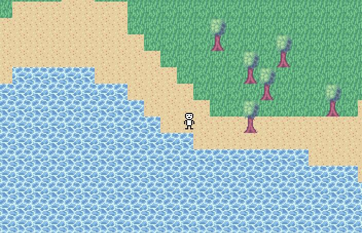

# GaymWTF

[](https://www.rust-lang.org/)
[](LICENSE)

## 🎮 О проекте

GaymWTF - это пиксельная игра с изометрической проекцией, написанная на языке Rust с использованием движка Macroquad.

## 🌍 Особенности

- Процедурная генерация мира с различными биомами
- Система сохранения/загрузки миров
- Меню и пользовательский интерфейс
- Использование [gaymwtf-core](https://github.com/BenimFurka/gaymwtf-core)

## 🛠️ Установка

1. Убедись, что у тебя установлен Rust (последняя стабильная версия)
2. Клонируй репозиторий:
   ```bash
   git clone https://github.com/BenimFurka/gaymwtf-bin.git
   cd gaymwtf-bin
   ```
3. Установи зависимости:
   ```bash
   cargo build
   ```

## 🚀 Запуск

```bash
cargo run --release
```

## 🏗️ Структура проекта

- `src/` - Исходный код игры
  - `biomes/` - Реализация биомов
  - `entities/` - Игровые сущности
  - `menus/` - Игровые меню и интерфейсы
  - `tiles/` - Тайлы мира
  - `player/` - Реализация игрока
  - `worldgen/` - Генерация мира
- `assets/` - Ресурсы игры (текстуры, шрифты)

## 📝 Лицензия

Этот проект лицензирован по [**Лицензии GPL v3**](LICENSE) - подробности см. в файле. 

## 🤝 Вклады

Вклады приветствуются! Пожалуйста, не стесняйтесь отправлять Pull Request или открывать Issue.

## 🙏 Благодарности

См. [ACKNOWLEDGMENTS.md](ACKNOWLEDGMENTS.md)

## 📸 Скриншоты 



*Мир*